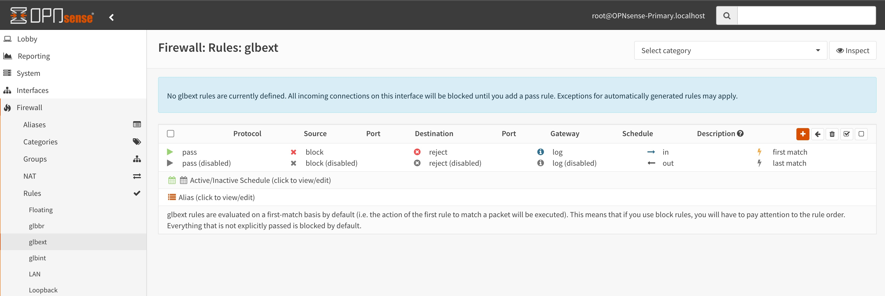
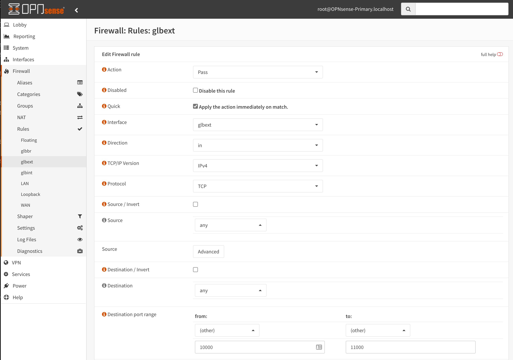
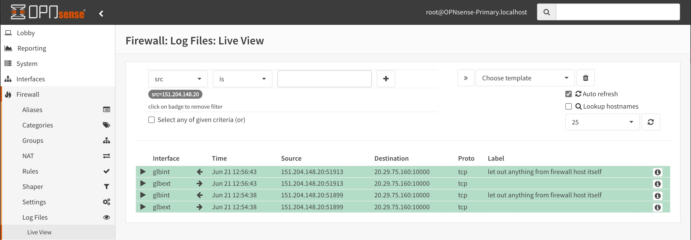

# aks-gwlb

This is a draft walk through of setting up AKS with a public Serivce that uses Azure Gateway LB to provide a bump in the wire firewall on the service public IP.

This is based on the repo by [Daniel Mauser](https://github.com/dmauser):

[https://github.com/dmauser/azure-gateway-lb](https://github.com/dmauser/azure-gateway-lb)

## Create the network and AKS cluster

First we need to create the Gateway Load Balancer consuming system, which will be an AKS cluster running [Agones](https://agones.dev/site/). 

1. Initialize our variables:

    ```bash
    consumer_rg=glb-lab
    consumer_location=centralus
    consumervnetcidr="10.30.0.0/16"
    consumersubnet="10.30.1.0/24"
    mypip=$(curl -4 ifconfig.io -s) # or replace with your home public ip, example mypip="1.1.1.1" (required for Cloud Shell deployments)
    username=""
    password=""
    ```

1. Create the resource group and vnet:

    ```bash
    # Create the resource group
    az group create --name $consumer_rg --location $consumer_location
    # Create the consumer vnet
    az network vnet create --resource-group $consumer_rg --name consumer-vnet --location $consumer_location --address-prefixes $consumervnetcidr --subnet-name vmsubnet --subnet-prefix $consumersubnet
    ```

1. Get the subnet ID and create the AKS cluster:

    ```bash
    # Get the subnet id
    subnetid=$(az network vnet show -g $consumer_rg -n consumer-vnet -o tsv --query "subnets[?name=='vmsubnet'].id")

    # Create an AKS cluster
    az aks create \
    -g $consumer_rg \
    -n consumer-aks \
    -l $consumer_location \
    --vnet-subnet-id $subnetid
    ```

1. Get the cluster credentials and deploy Agones:

    ```bash
    # Get cluster credentials
    az aks get-credentials -g $consumer_rg -n consumer-aks

    # Install Agones (https://agones.dev/site/docs/installation/install-agones/yaml/)
    kubectl create namespace agones-system
    kubectl apply -f https://raw.githubusercontent.com/googleforgames/agones/release-1.23.0/install/yaml/install.yaml
    ```

1. Deploy a game server and get some values, which we'll use more extensively later, and test the gameserver:

    ```bash
    # Deploy a Game Server (https://agones.dev/site/docs/getting-started/create-gameserver/)
    kubectl create -f https://raw.githubusercontent.com/googleforgames/agones/release-1.23.0/examples/simple-game-server/gameserver.yaml

    # Get the Game Name Server IP and port
    gameservername=$(kubectl get gs -o jsonpath='{.items[0].metadata.name}')
    gameservernodename=$(kubectl get gs -o jsonpath='{.items[0].status.nodeName}')
    gameserverip=$(kubectl get gs -o jsonpath='{.items[0].status.address}')
    gameserverport=$(kubectl get gs -o jsonpath='{.items[0].status.ports[0].port}')

    # Test the Game Server
    # After running this command you can type messages in the terminal and they 
    # will be echoed by the game server via netcat
    kubectl run netcat -it --rm --image=busybox -- nc -u $gameserverip $gameserverport

    # Hit CTRL-C to exit the pod
    ```

## Create the Gateway Loadbalancer and Deploy OpnSense

1. Initialize our environment variables: 

    ```bash
    # Provision the provider
    provider_rg=glb-lab
    provider_location=centralus
    providervnetcidr="10.40.0.0/24"
    providerexternalcidr="10.40.0.0/27"
    providerinternalcidr="10.40.0.32/27"
    nva=provider-nva
    ```

1. Create the Resource Group and Network

    ```bash
    # Create the provider resource group
    az group create --name $provider_rg --location $provider_location --output none

    # Create the provider vnet and subnets
    az network vnet create --resource-group $provider_rg --name provider-vnet --location $provider_location --address-prefixes $providervnetcidr --subnet-name external --subnet-prefix $providerexternalcidr --output none
    az network vnet subnet create --name internal --resource-group $provider_rg --vnet-name provider-vnet --address-prefix $providerinternalcidr --output none
    ```

1. Deploy the OpnSense NVA instances:

    ```bash
    # Deploy the OPNsense NVA
    az deployment group create --name $nva-deploy-$RANDOM --resource-group $provider_rg \
    --template-file ./bicep/glb-active-active.json \
    --parameters virtualMachineSize=Standard_B2s virtualMachineName=$nva TempUsername=azureuser TempPassword=Msft123Msft123 existingVirtualNetworkName=provider-vnet existingUntrustedSubnet=external existingTrustedSubnet=internal PublicIPAddressSku=Standard
    ```

## Create a Load Balancer and NAT rule for the Game Server

1. Create the Game Server instance Public IP:

    ```bash
    az network public-ip create \
    --resource-group $consumer_rg  \
    --name $gameservernodename \
    --sku Standard
    ```
1. Create the Load Balancer:

    ```bash
    az network lb create \
    --resource-group $consumer_rg \
    --name gameserver-lb \
    --sku Standard \
    --public-ip-address $gameservernodename
    ```

1. Create the backend pool configuration and inbound NAT rule:

    ``` bash
    az network lb address-pool address add \
    -g $consumer_rg \
    --lb-name gameserver-lb \
    --pool-name gameserver-lbbepool \
    -n $gameservernodename \
    --vnet consumer-vnet \
    --ip-address $gameserverip


    # Create the NAT rule for the game server
    az network lb inbound-nat-rule create \
    -g $consumer_rg \
    --lb-name gameserver-lb \
    --name $gameservername \
    --protocol udp \
    --backend-pool-name gameserver-lbbepool \
    --frontend-port-range-start $gameserverport \
    --frontend-port-range-end $gameserverport \
    --backend-port $gameserverport
    ```

1. Open up the game server port on the Managed Cluster NSG

```bash
managedcluster_rg=$(az aks show -g $consumer_rg -n consumer-aks -o tsv --query nodeResourceGroup)
managednsg=$(az network nsg list -g $managedcluster_rg -o tsv --query '[0].name')

az network nsg rule create \
-g $managedcluster_rg \
--nsg-name $managednsg \
-n $gameservername \
--access Allow \
--protocol Udp \
--destination-port-ranges $gameserverport \
--priority 100
```

2. Get the Game Server Public IP and test the NAT rule

    ```bash
    # Get the public IP
    gameserverpubip=$(az network public-ip show --resource-group $consumer_rg --name $gameservernodename -o tsv --query ipAddress)

    # Netcat through the SLB NAT Rule
    nc -u $gameserverpubip $gameserverport
    ```

### Connect the Game Server IP to the Gateway Loadbalancer

1. Get the Gateway LB Frontent IP ID

    ```bash
    # Get the Gateway Load Balancer Frontend IP ID
    glbfeid=$(az network lb frontend-ip show -g $provider_rg --lb-name provider-nva-glb --name FW --query id --output tsv)
    ```

1. Update the game server frontend IP to point to the gateway load balancer

    ```bash
    az network lb frontend-ip update \
    -g $consumer_rg \
    --name LoadBalancerFrontEnd \
    --lb-name gameserver-lb \
    --gateway-lb $glbfeid 
    ```

1. Open your browser and navigate to the OpnSense NVA and allow the game server port

    

    

1. Login with the default userid (root) and password (opnsense). You should then immediately change the password. You should update the password on both the primary and secondary OpnSense servers and then update the remote password setting in 'High Availability' 'System Settings' to make sure the two servers can sync with each other.


1. Go to the Firewall Rules section for glbext to add the UDP rule for the game server.

    

1. Set the protocol to UDP and the Destination Port Range from 7000 to 8000

    

1. Save the rule and then click 'Apply Changes' at the top of the page. You can then click on the ' System: High availablity: status' link and initiate a synchronization with the other instance.

1. Test your netcat and check the firewall logs

    ```bash
    nc -u $gameserverpubip $gameserverport
    Hello
    ACK: Hello
    World
    ACK: World
    ```

    >*Note:* You can filter the logs using your public IP
    
    